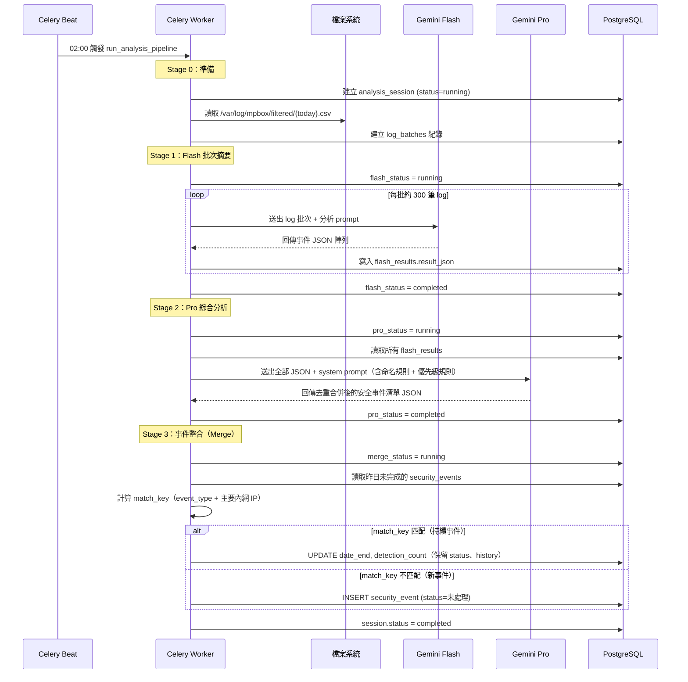

# 分析 Pipeline 流程

> 每日凌晨 02:00 由 Celery Beat 自動觸發，或由使用者手動上傳 CSV 觸發



## 事件整合規則（match_key）

```python
match_key = f"{event_type.lower().replace(' ', '_')}::{primary_internal_ip}"
# 範例："dns_c2_通訊::192.168.10.20"
```

| 情境 | 今日有 | DB 有 | DB 狀態 | 動作 |
|------|-------|------|--------|------|
| 新事件 | ✓ | ✗ | — | INSERT，status=未處理 |
| 持續事件 | ✓ | ✓ | 未處理/處理中 | UPDATE date_end + detection_count |
| 持續但已擱置 | ✓ | ✓ | 擱置 | UPDATE date_end + detection_count，status 不動 |
| 復發事件 | ✓ | ✓ | 已完成 | INSERT 新事件（不影響舊紀錄） |
| 消失事件 | ✗ | ✓ | 任何 | 不動，保留原紀錄 |

**不可覆蓋欄位**：`current_status`、`event_history`、`resolution`、`id`
