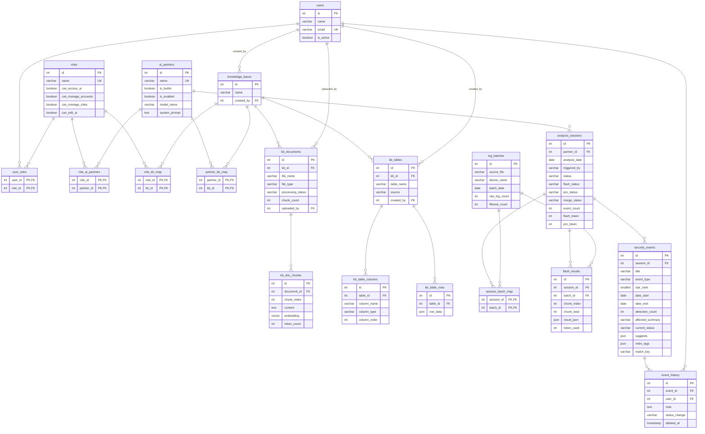

# MP-Box 資料庫 ER Diagram

> Schema 版本：v3 | 更新日期：2026-03-17
> 來源：`database/mpbox_postgresql_v3_drawsql.sql`



## 領域說明

| 領域 | 資料表 | 說明 |
|------|-------|------|
| 使用者/角色 | users, roles, user_roles | 帳號管理與功能權限控制 |
| AI 夥伴 | ai_partners, role_ai_partners | 可自訂 system prompt 的 AI 角色；角色決定使用者可使用哪個 AI 夥伴 |
| 知識庫（非結構化） | knowledge_bases, kb_documents, kb_doc_chunks | PDF/Word/TXT → 分塊 → pgvector embedding，供 RAG 查詢 |
| 知識庫（結構化） | kb_tables, kb_table_columns, kb_table_rows | 人工維護的資料表（設備清單、IP 白名單等），供 AI 生成 SQL 查詢 |
| 知識庫存取控制 | role_kb_map, partner_kb_map | 哪些角色可讀取哪個知識庫；哪個 AI 夥伴綁定哪個知識庫 |
| 分析 Pipeline | log_batches, analysis_sessions, session_batch_map, flash_results | 每次分析工作的狀態追蹤與 Flash 中間結果 |
| 安全事件 | security_events, event_history | AI 產出的安全事件清單，附人工處置紀錄（軟刪除） |
```
