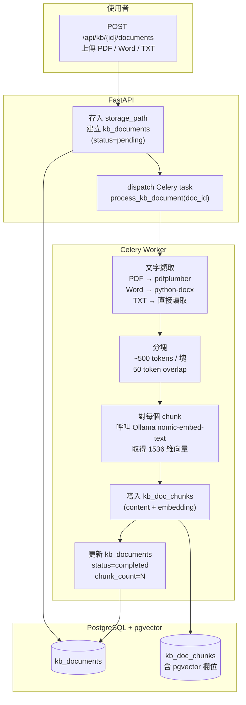
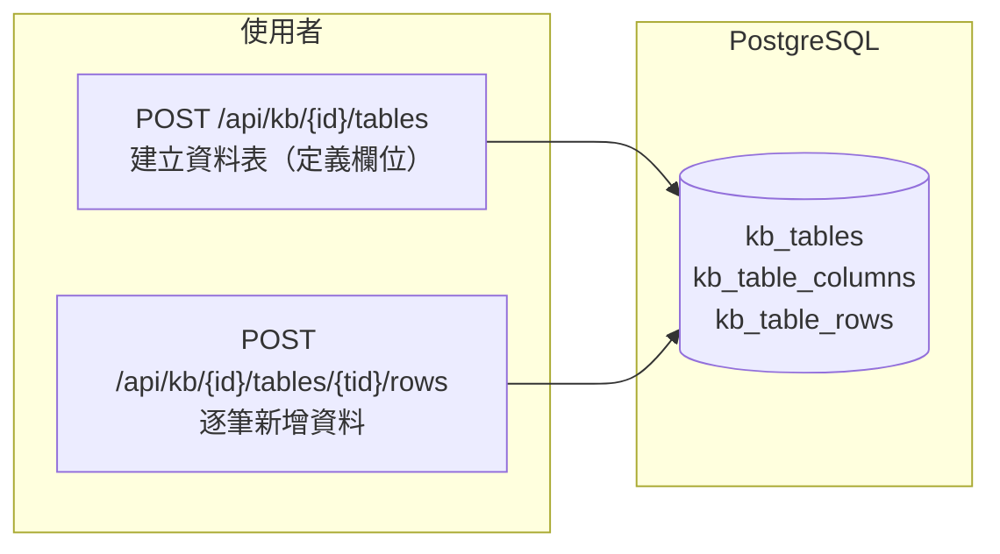
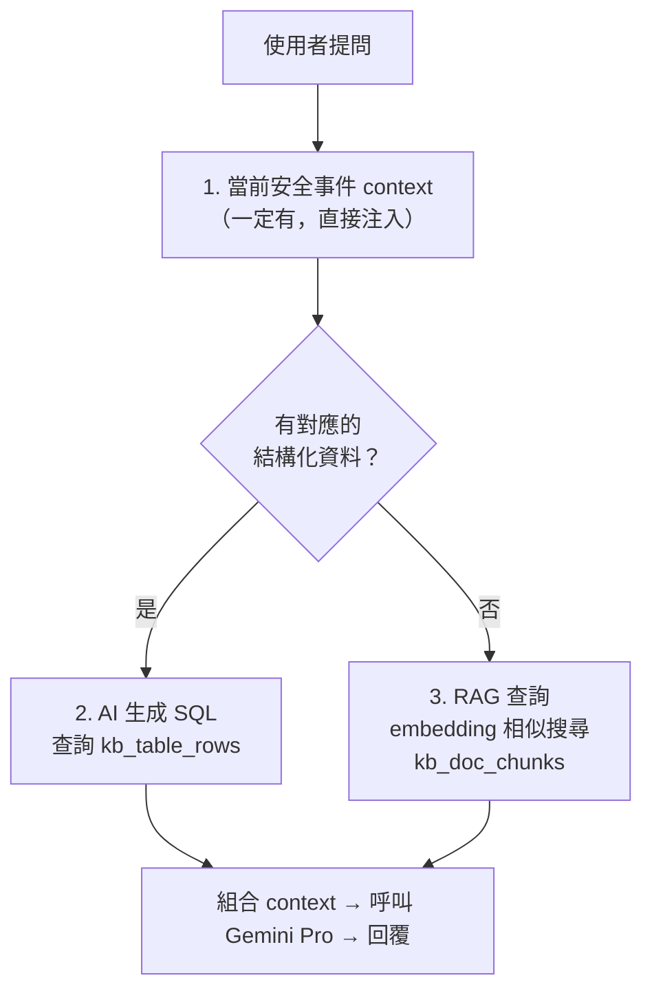

# 知識庫上傳流程

> 涵蓋兩種知識庫類型：非結構化文件（PDF/Word/TXT）和結構化資料表

## 非結構化文件上傳（RAG 路徑）

## 結構化資料表（SQL 查詢路徑）

## AI 諮詢時的知識庫查詢順序

| 查詢類型 | 來源 | 用途範例 |
|---------|------|---------|
| 當前事件 context | security_events（直接注入） | 事件標題、建議處置、處置紀錄 |
| 結構化查詢 | kb_table_rows（AI 生成 SQL） | 查詢受影響設備的型號、確認 IP 是否在白名單 |
| 非結構化 RAG | kb_doc_chunks（pgvector 相似搜尋） | 找到對應的 SOP、處置指南、歷史案例 |
