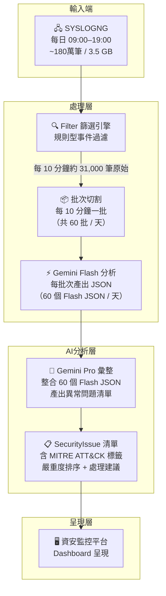
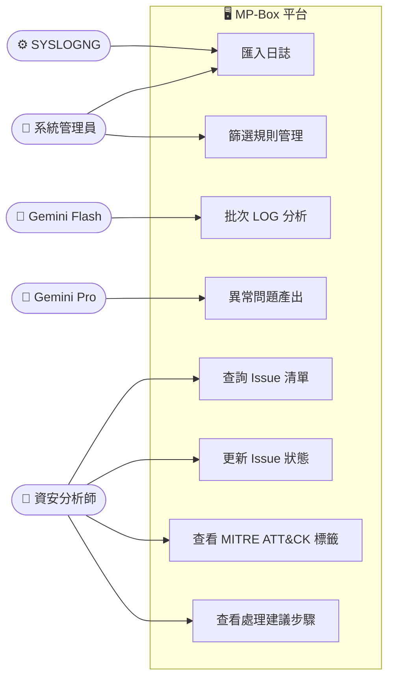
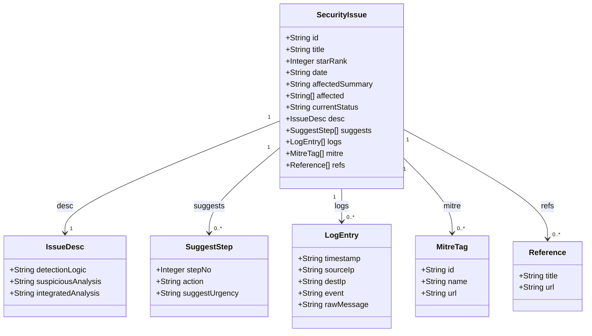

# LOG 處理流程圖與 JSON Schema

## 圖 1：系統架構與資料流（Flowchart）



---

## 圖 2：Use Case Diagram



---

## 圖 3：Class Diagram（JSON Schema）



---

### SuggestUrgency 值域

| 值 | 說明 |
|---|---|
| `立即` | 需立刻處理，風險極高 |
| `今日` | 今天內完成處理 |
| `24小時內` | 24 小時內完成 |
| `本週` | 本週內完成即可 |

### CurrentStatus 值域

| 值 | 說明 |
|---|---|
| `待處理` | 尚未開始處理 |
| `處理中` | 已指派，正在處理 |

---

### JSON 範例（單筆 SecurityIssue）

```json
{
  "id": "issue-001",
  "title": "多次失敗登入嘗試（Brute Force）",
  "starRank": 4,
  "date": "2025-11-05",
  "affectedSummary": "內部主機 192.168.1.105",
  "affected": ["192.168.1.105"],
  "currentStatus": "待處理",
  "desc": {
    "detectionLogic": "偵測到來自同一 IP 在 5 分鐘內失敗登入次數超過 20 次",
    "suspiciousAnalysis": "來源 IP 103.45.67.89 非企業已知地址，嘗試帳號包含常見弱密碼清單",
    "integratedAnalysis": "結合時間序列與帳號分佈，判斷為自動化暴力破解攻擊"
  },
  "suggests": [
    {
      "stepNo": 1,
      "action": "封鎖來源 IP 103.45.67.89 於防火牆",
      "suggestUrgency": "立即"
    },
    {
      "stepNo": 2,
      "action": "重設受影響帳號密碼並啟用 MFA",
      "suggestUrgency": "今日"
    }
  ],
  "logs": [
    {
      "timestamp": "2025-11-05T10:32:15Z",
      "sourceIp": "103.45.67.89",
      "destIp": "192.168.1.105",
      "event": "AUTH_FAILURE",
      "rawMessage": "Failed password for admin from 103.45.67.89 port 54321 ssh2"
    }
  ],
  "mitre": [
    {
      "id": "T1110",
      "name": "Brute Force",
      "url": "https://attack.mitre.org/techniques/T1110/"
    }
  ],
  "refs": [
    {
      "title": "NIST 密碼政策指南",
      "url": "https://pages.nist.gov/800-63-3/"
    }
  ]
}
```
