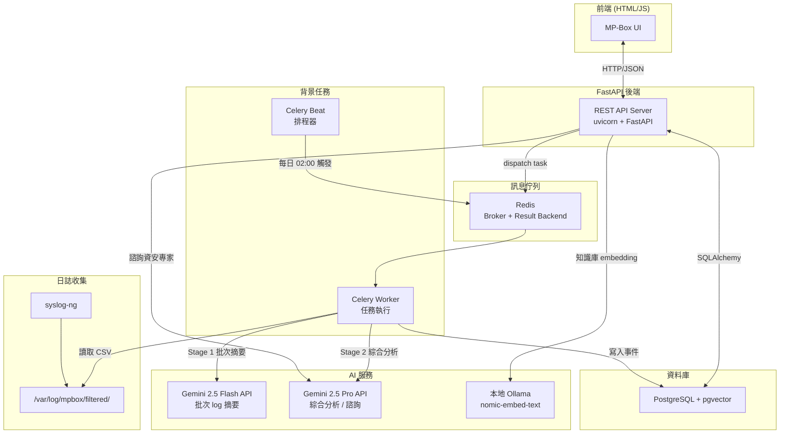

# 系統架構圖

> 技術棧：FastAPI + Celery + Redis + PostgreSQL + pgvector
> AI 模型：Gemini 2.5 Flash（批次摘要）、Gemini 2.5 Pro（綜合分析/諮詢）、Ollama nomic-embed-text（Embedding）

## 元件職責

| 元件 | 職責 |
|------|------|
| FastAPI (REST) | 前端 API、知識庫管理、諮詢 chat、手動觸發分析 |
| Celery Beat | 定時排程（每日凌晨 2:00 觸發分析 pipeline） |
| Celery Worker | 執行分析 pipeline（讀 log → Flash → Pro → merge → 寫 DB） |
| Redis | Celery broker + task result backend |
| PostgreSQL + pgvector | 全部業務資料 + 知識庫向量索引 |
| Gemini Flash | Stage 1：每批 300 筆 log 快速摘要，輸出中間 JSON |
| Gemini Pro | Stage 2：彙整所有 Flash 結果產出安全事件；即時回覆諮詢問題 |
| Ollama nomic-embed-text | 知識庫文件 embedding（本地執行，無外部費用） |
| syslog-ng | AD/FortiGate/Windows Server log 收集與過濾（原始→過濾 CSV） |
