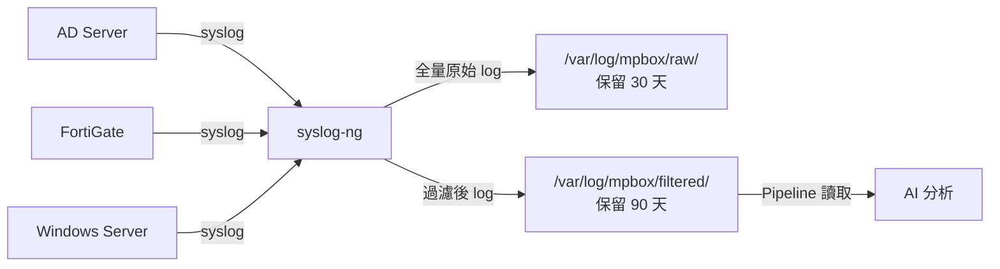

# syslog-ng 過濾規則

> 預估過濾效果：180 萬筆 → 1.5 ~ 2 萬筆（保留率約 1%）

## 架構定位



## 完整設定

```conf
# /etc/syslog-ng/conf.d/mpbox.conf

source s_network {
    tcp(port(514) flags(syslog-protocol));
    udp(port(514));
};

# FortiGate 過濾（保留 warning 以上 OR 特定 logid OR deny/block）
filter f_forti_severity { level(warning..emerg); };
filter f_forti_logid {
    match("logid=0[14]" value("MESSAGE"))   # anomaly / traffic-violation
    or match("logid=16" value("MESSAGE"))   # utm-attack
    or match("logid=20" value("MESSAGE"))   # ips
    or match("logid=09" value("MESSAGE"))   # vpn
    or match("logid=22" value("MESSAGE"));  # dns-filter
};
filter f_forti_action {
    match("action=(?:deny|block|dropped|blocked)" value("MESSAGE"));
};
filter f_fortigate_keep { f_forti_severity or f_forti_logid or f_forti_action; };
filter f_forti_exclude {
    match("action=accept" value("MESSAGE"))
    and match("logid=0000" value("MESSAGE"))
    and not match("policyid=0" value("MESSAGE"));
};

# Windows Server 過濾（EventID 白名單）
filter f_windows_keep {
    match("EventID=4624" value("MESSAGE")) or match("EventID=4625" value("MESSAGE"))  # 登入成功/失敗
    or match("EventID=4648" value("MESSAGE")) or match("EventID=4672" value("MESSAGE")) # 明確憑證/特權
    or match("EventID=4720" value("MESSAGE")) or match("EventID=4722" value("MESSAGE")) # 帳號建立/啟用
    or match("EventID=4723" value("MESSAGE")) or match("EventID=4724" value("MESSAGE")) # 密碼變更/重設
    or match("EventID=4725" value("MESSAGE")) or match("EventID=4726" value("MESSAGE")) # 帳號停用/刪除
    or match("EventID=4728" value("MESSAGE")) or match("EventID=4732" value("MESSAGE")) # 加入群組
    or match("EventID=4738" value("MESSAGE")) or match("EventID=4740" value("MESSAGE")) # 帳號屬性/鎖定
    or match("EventID=4698" value("MESSAGE")) or match("EventID=7045" value("MESSAGE")) # 排程/服務
    or match("EventID=4946" value("MESSAGE")) or match("EventID=4947" value("MESSAGE")) # 防火牆規則
    or match("EventID=4688" value("MESSAGE"));                                          # 程序建立
};
filter f_windows_exclude {
    match("EventID=4624" value("MESSAGE"))
    and match("TargetUserName=.*\\$$" value("MESSAGE"))
    and match("LogonType=(3|7)" value("MESSAGE"));  # 機器帳號的正常網路登入
};

# AD Server（繼承 Windows 白名單 + 目錄服務事件）
filter f_ad_keep {
    match("EventID=5136" value("MESSAGE")) or match("EventID=5137" value("MESSAGE"))  # 物件修改/建立
    or match("EventID=5141" value("MESSAGE")) or match("EventID=5139" value("MESSAGE")) # 物件刪除/移動
    or match("EventID=4929" value("MESSAGE"))   # AD 複寫失敗
    or f_windows_keep;
};

# 來源綁定
filter f_fortigate { host("10.1.1.1") and f_fortigate_keep and not f_forti_exclude; };
filter f_winserver  { host("10.1.1.10") and f_windows_keep and not f_windows_exclude; };
filter f_ad         { host("10.1.1.20") and f_ad_keep; };
filter f_mpbox_all  { f_fortigate or f_winserver or f_ad; };

# 輸出：全量原始
destination d_raw {
    file("/var/log/mpbox/raw/${YEAR}-${MONTH}-${DAY}_${HOST}.log"
         create-dirs(yes)
         template("${ISODATE} ${HOST} ${PROGRAM} ${MESSAGE}\n"));
};

# 輸出：過濾後 CSV（供 Pipeline 讀取）
destination d_filtered {
    file("/var/log/mpbox/filtered/${YEAR}-${MONTH}-${DAY}_filtered.csv"
         create-dirs(yes)
         template("${ISODATE},${HOST},${PROGRAM},${LEVEL},\"${MESSAGE}\"\n"));
};

log { source(s_network); destination(d_raw); };
log { source(s_network); filter(f_mpbox_all); destination(d_filtered); };
```

## 日誌輪替

```conf
# /etc/logrotate.d/mpbox
/var/log/mpbox/raw/*.log    { daily; rotate 30; compress; postrotate /usr/sbin/syslog-ng-ctl reload; endscript }
/var/log/mpbox/filtered/*.csv { daily; rotate 90; compress; }
```
